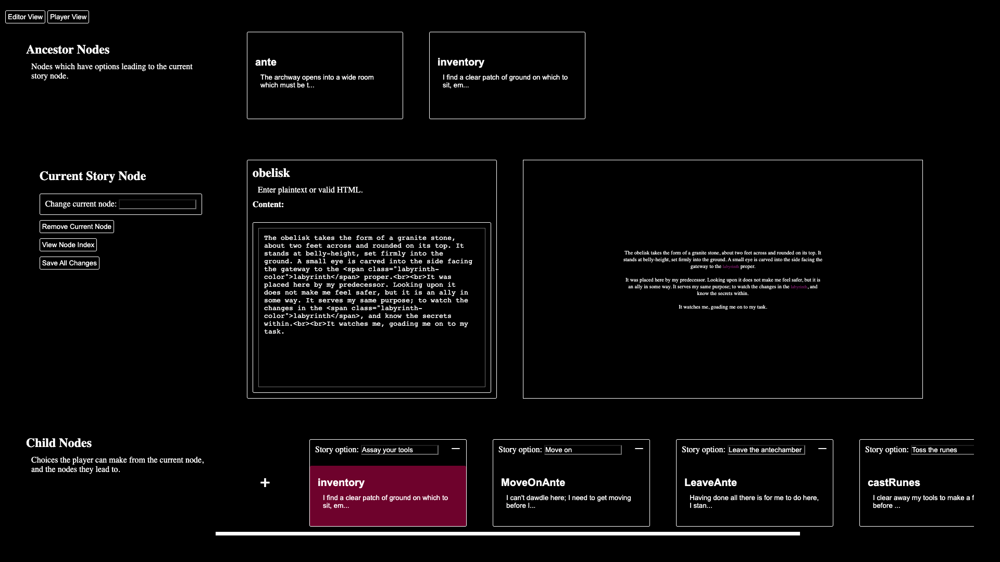
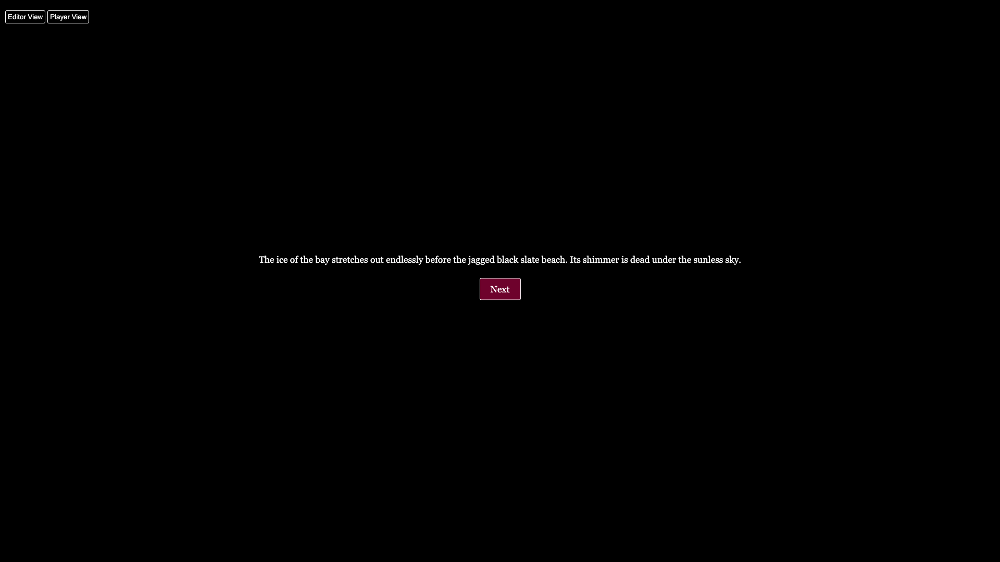

# Page-Exploration

A library for writing, and managing progress through, a branching or nonlinear story. First made as a rebuilt game logic for my game Keeper of the Labyrinth.
 

 
Easily manage multiple options in the editor view.

 
A clean reader view shows what the reader will see.

## Features
<ul style="list-style-type: square;">
<li>Purpose-built visual editor for traversing a nonlinear story.</li>
<li>Allows the writer to edit story node text and options / links between nodes on the fly.</li>
<li>Provides a fully-functional editor mode and a bare-bones reader mode.</li>
<li>Export and import stories to a portable JSON format.</li>
<li>Story Renderer class capable of reading JSON story files can be easily imported to other HTML-based projects and built on top of as a back-end.</li>
</ul>

## How to use
To **use the visual editor**,
1. Use `tsc` to compile the project directory.
2. Make sure `mainFile` in `main.js` is set to `full-editor.html`.
3. The editor doesn't have a frontpage yet, so to select which story to edit or to make a new one, enter the filename and so forth into `full-editor-application.ts` as directed in the first block after the import statements.
4. Calling `npm start` will run the application through `electron-forge`.
5. You can also serve `full-editor.html` onto your own localhost node.js server if you like. (It has to be on a node server; it won't work to simply open in browser because the application will lack read/write permissions.)
5. Go write a cool nonlinear story and please let me know if this app worked for you or if you notice any bugs!

To **use the renderer in your own project**,
1. Copy the `scripts` directory somewhere into your project.
2. Make sure you have a `story_data` folder in your project's root directory, and your `storyname.json` file is in it.
3. In a script tag or file linked to your project HTML document, import `prepareStoryInstance` and `StoryRenderer`.
4. Use `prepareStoryInstance` to read your story from disc, and pass that story to a new `StoryRenderer` instance. An example of this can be seen in `renderer-only-application.ts`
4. The `StoryRenderer` will automatically render story content and options into divs with the ids `story-text` and `story-options`. Make sure these exist somewhere in your HTML structure and you're golden!
5. Let me know what project you're using my little app for, because I'd love to hear all about it!! :)

## Long term project goals & known issues
<ul style="list-style-type: square;">
<li>A menu for setting "conditional story options" only shown to the reader dependent on writer-defined logic. Currently functional but waiting on front-end implementation.</li>
<li>Reader state tracking and an attached event system for incrementing scores, printing images, and other functionality to be called when a reader traverses particular nodes.</li>
<li>An autosave system that clears out older autosaves after a while; currently they just stack up in `story_data` endlessly.</li>
</ul>
